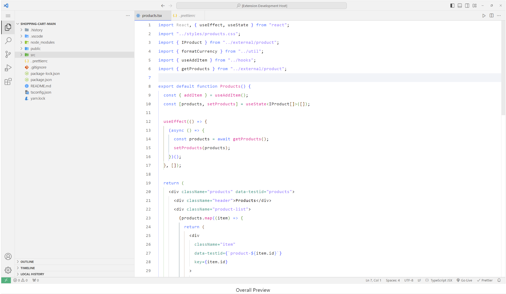
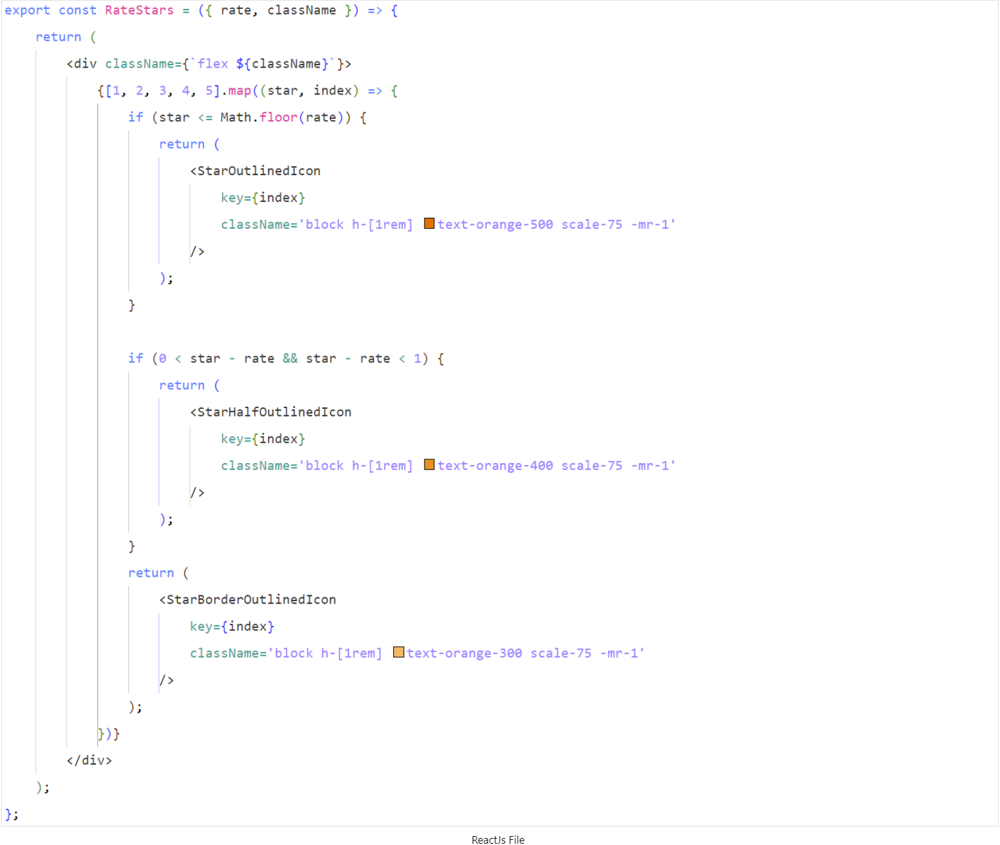

# Ebullience theme

A light minimal theme which is based on Intellij's Modern Light theme.

# Screenshots

<figure style="margin: 0px">
  
  <figcaption style="text-align:center">Overall Preview</figcaption>
</figure>

<figure style="margin: 0px">
  
  <figcaption style="text-align:center">ReactJs File</figcaption>
</figure>

<figure style="margin: 0px">
  
  <figcaption style="text-align:center">Css File</figcaption>
</figure>

# Installation

1. Open tab **Extension** panel in VSCode
2. Search for **Ebullience** in search bar.
3. Install and select as your theme.
